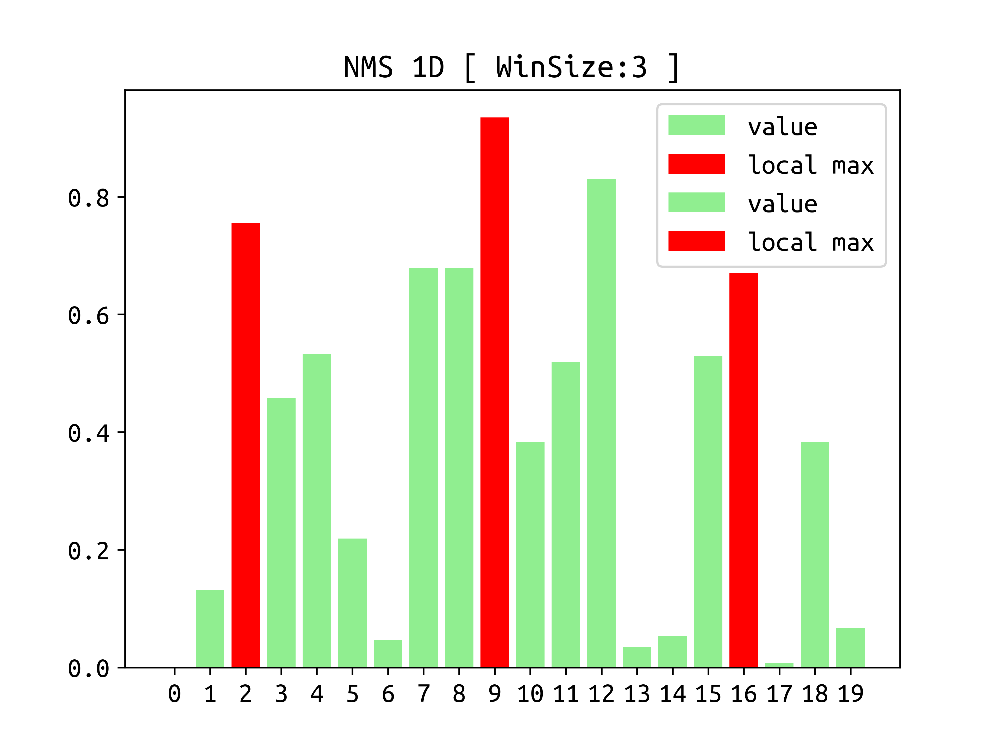
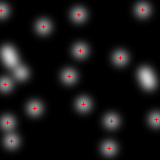
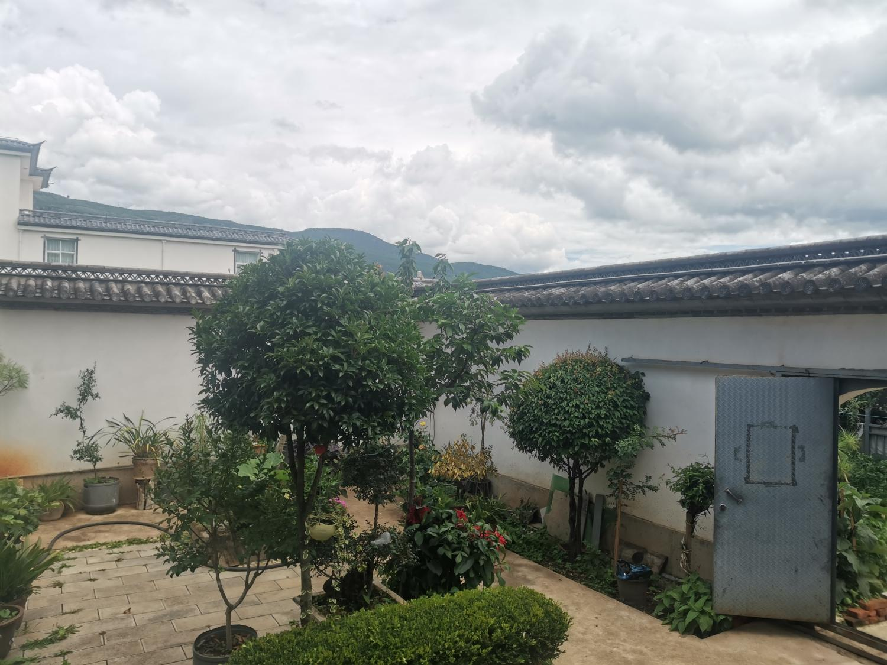
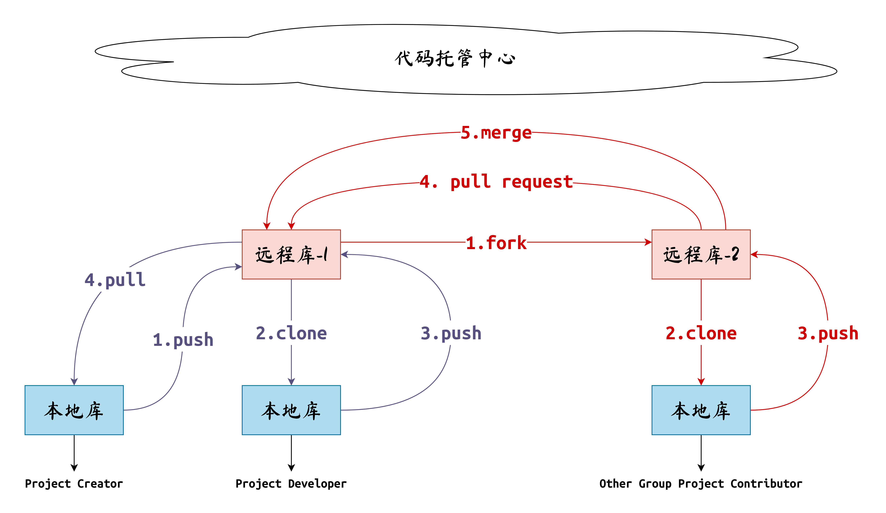
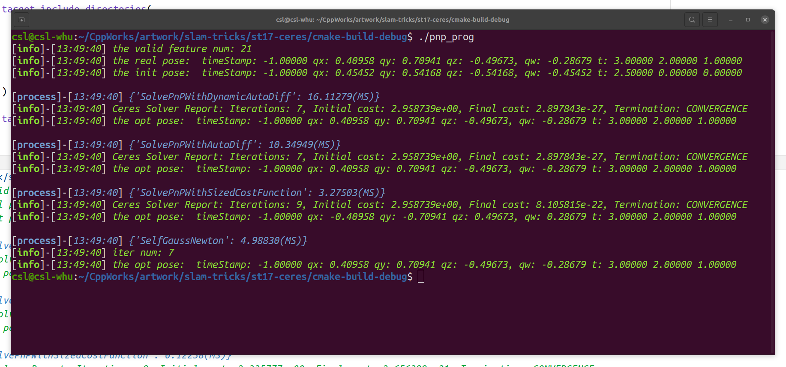

# Slam Tricks

*__Author: shlChen__*

***E-Mail: 3079625093@qq.com***

[TOC]

## 1. Overview

本项目旨在记录一些SLAM中常用到的一些算法和小技巧，有些能够直接改善代码的效率，有些则能够给人一些启发。目前实现了一些简单、有用的小算法。

## 2. Details

### 2.1 [图像和像素点去畸变](./st1-undistort/) 

SLAM中一般不会谈及图像畸变的问题，因为我们都假设图像或者像素点都已经基于畸变模型和畸变参数做了处理，传入的是一些不存在畸变的像片或者像素点。但是这确实一个很必要优化的东西，虽然OpenCV库已经提供了比较完整的函数、方法。该项目的原理介绍以PDF的格式展示，具体的位置为[算法原理](./st1-undistort/docs/undistort.pdf)。项目的成果：

+ 完成了基于图片的去畸变算法。在算法中使用了两种插值算法（最邻近和双线性）：

```cpp
  /**
   * @brief undistort a gray image
   *
   * @param src the distorted gray image [CV_8UC1]
   * @param innerParam the camera's inner parameters
   * @param distCoff the camera's distortion parameters
   * @param methods the interpolation choice
   * @return cv::Mat the undistorted gray image [CV_8UC1]
   */
  static cv::Mat undistortImage(
      cv::Mat src,
      const CameraInnerParam &innerParam,
      const CameraDistCoff &distCoff,
      Interpolation methods = Interpolation::NEAREST_NEIGHBOR) {...}
```


+ 完成了基于点的去畸变算法。其依托于高斯牛顿法，速度和精度都比OpenCV提供的要好：

```cpp
  /**
   * @brief undistort a pixel point
   *
   * @param srcPt the distorted point
   * @param innerParam the camera's inner parameters
   * @param distCoff the camera's distortion parameters
   * @param threshold the threshold to stop iterator
   * @param iterator the interator times
   * @return cv::Point2f the undistoerted pixel point
   */
  static cv::Point2f undistortPoint(
      cv::Point2f srcPt,
      const CameraInnerParam &innerParam,
      const CameraDistCoff &distCoff,
      float threshold = 1E-5,
      int iterator = 5) {...}
```

### 2.2 [对极几何](./st2-epipolar)

在使用单目相机进行$SLAM$的时候，必不可少的一步就是初始化。由于单目相机的尺度是未知的，所以一般初始化的方式是通过对极几何约束，解算出两帧图像之间的位姿变换，来进行初始化。该项目的原理介绍以PDF的格式展示，具体的位置为[算法原理](./st2-epipolar/docs/epipolar.pdf)。项目的成果：

+ 实现了基于卡方检验的本质矩阵求解：

```cpp
  /**
   * @brief to get function matrix based on the epipolar constraints
   *
   * @param kps1 the keypoints in the first image
   * @param kps2 the keypoints in the second image
   * @param srcMatches the source matches, It can be matching data without preprocessing
   * @param goodMatches the good matches that this algorithm return
   * @param quantile the quantile to judge whether a match is an outlier
   * @return Eigen::Matrix3f the function matrix
   */
  static Eigen::Matrix3f solveEpipolar(
      const std::vector<cv::KeyPoint> &kps1,
      const std::vector<cv::KeyPoint> &kps2,
      const std::vector<cv::DMatch> &srcMatches,
      const CameraInnerParam &innerParam,
      std::vector<cv::DMatch> *goodMatches = nullptr,
      float quantile = 1.323) {...}
```


+ 实现了基于本质矩阵的运动恢复：

```cpp
  /**
   * @brief recovery the movement from the essential matrix
   *
   * @param eMatrix the essential matrix
   * @param K the camera's inner paramters
   * @param kp1 the key point in first frame
   * @param kp2 the key point in second frame
   * @param rot21 rotation matrix from first frame to second frame
   * @param t21 translation matrix from first frame to second frame
   * @return true the process is successful
   * @return false the process is failed
   */
  static bool recoveryMove(
      const Eigen::Matrix3f &eMatrix,
      const Eigen::Matrix3f &K,
      const cv::KeyPoint &kp1,
      const cv::KeyPoint &kp2,
      Eigen::Matrix3f &rot21,
      Eigen::Vector3f &t21) {...}
```


+ 实现了三角化：

```cpp
  /**
   * @brief to trangular a pair points on the normalized coordinate
   *
   * @param X1 the point on the first camera's normalized coordinate
   * @param X2 the point on the second camera's normalized coordinate
   * @param rot21 the rotation from first camera to second camera
   * @param t21 the translation from first camera to second camera
   * @param P1 the point on the first camera's coordinate
   * @param P2 the point on the second camera's coordinate
   * @return std::pair<float, float> the depth pair
   */
  static std::pair<float, float> triangulation(
      const Eigen::Vector3f &X1,
      const Eigen::Vector3f &X2,
      const Eigen::Matrix3f &rot21,
      const Eigen::Vector3f &t21,
      Eigen::Vector3f *P1 = nullptr,
      Eigen::Vector3f *P2 = nullptr) {...}
```

### 2.3 [相机标定](./st3-calibration)

相机标定是进行视觉SLAM的前提，其虽然在VSLAM这个大工程中只是一小部分，但是其重要性却是显而易见的。目前存在多种相机标定的算法和操作方法。不同的方法在精度、复杂度和适应场景都存在差异。在本文中，主要讲解张正友相机标定法。该项目的原理介绍以PDF的格式展示，具体的位置为[算法原理](./st3-calibration/docs/calibration.pdf)。


### 2.4 [位姿轨迹滤波](./st4-kalman)

SLAM中估计的手段一般有两种：基于滤波的方式和基于非线性优化的方式。本次模拟了一个用于算法开发的位姿轨迹。同时，本文基于卡尔曼滤波的方式，给出了对一个位姿轨迹的估计滤波过程。该项目的原理介绍以PDF的格式展示，具体的位置为[算法原理](./st4-kalman/docs/kalman.pdf)。


### 2.4 [光流](./st5-opticalflow)

光流法基于光度不变假设，估计像素的运动特性，进而实现点的追踪。slam中的直接法基于其，将像点和物点相联系，构建了优化目标函数，进而求解相机位姿变换。

### 2.5 [ICP](./st6-icp)

ICP 算法是求解两帧点之间的位姿变换关系的一种经典方法，其对点间有匹配和点间无匹配的点云帧都有着比较鲁棒的估计结果。具体的位置为[算法原理](./st6-icp/docs/icp.pdf)。


### 2.6 RANSAC

RANSCA算法是一种基于概率的模型构建手段。其相较于最小二乘法，能够在数据集存在较多粗差或者误差数据的情况下，重构处正确的模型。具体文档为[算法原理](./st7-ransac/docs/ransac.pdf)。


### 2.7 NMS非极大值抑制

在进行图像处理时，当我们用特定算法提取图像中的特定对象时，往往会在局域内有多个响应对象，如图像角点的提取、图像识别物体区域、图像边缘提取等。通过NMS算法的处理，我们可以提取冗余的对象，得到响应最佳的对象。[算法文档](./st8-nms/docs/nms.pdf)。





### 2.8 射影变换

射影变换是最一般的几何变换。对于二维平面的变换而言，其有8个自由度。相机拍摄场景实际上就是一种射影变换，为此，我们可以对像片中感兴趣区域进行射影变换，将原始图片中的纸张进行反射影变换，得到了纸张的正射投影图像，对于人眼而言，更加易于识别。[算法文档](./st9-projective/docs/projective.pdf)。


### 2.9 棋盘格网点结构恢复

最经典的相机标定方法是张正友方法。但是该方法的前提是获得棋盘的格网点（结构）。本次参考论文《Automatic Camera and Range Sensor Calibration using a single Shot》，实现了鲁棒的棋盘格结构提取。[算法文档](./st10-chessCorner/docs/chessCorner.pdf)。


### 3.0 图像全景拼接

通过多张相互部分重叠的影像，得到一副全景影像：
<figure class="third">
    
    
    
</figure>
<center>
    
</center>

<center>
    
</center>

### 3.1 ransacplus

RANSAC算法假设数据中包含正确数据和异常数据(或称为噪声)。该算法核心思想就是随机性和假设性，随机性是根据正确数据出现概率去随机选取抽样数据，根据大数定律，随机性模拟可以近似得到正确结果。假设性是假设选取出的抽样数据都是正确数据，然后用这些正确数据通过问题满足的模型，去计算其他点，然后对这次结果进行一个评分。

<figure class="half">
    
    
</figure>

### 3.2 视觉里程计之光流法

直接法和特征点法结果一样，同样可以估计两相邻图像帧之间的位姿变化量。其以"光度不变理论"为假设，相较于特征点法，不需要提取特征，有着更快的运行效率和更加广阔的应用场景。
<center>
    
    
</center>
### 3.3 惯性导航之机械编排

导航是指：运动物体随时间变化的位置(Position)、速度(Velocity)和姿态(Attitude)，这三者构成了导航姿态(PVA)。导航主要有两种原理：

+ 航位推算(Dead Reckoning)：通过推断连续帧间导航状态的变换量得到航迹，如视觉里程计(VO)、惯导(INS)；

+ 直接定位(Direct Fixing)：直接获得运动物体在参考坐标系下的导航状态，如卫导(GNSS)。

对于惯导而言，借助加速度计和陀螺仪测定载体相对于惯性空间的加速度和角速度。

### 3.4 Git代码管理

**Git** 是一个开源的分布式版本控制系统，用于敏捷高效地处理任何或小或大的项目。**Git** 是 **Linus Torvalds** 为了帮助管理 **Linux** 内核开发而开发的一个开放源码的版本控制软件。



### 3.5 PCL可视化

<figure class="half">
    
    
</figure>
### 3.6 Ceres解算
<center>
    

</center>
<figure class="half">
    
    
</figure>

### 3.7 CMake

```cmake
# -----------
# for install
# -----------

include(CMakePackageConfigHelpers)
include(GNUInstallDirs)

# Export package for use from the build tree
set(LIBRARY_CMAKE_EXPORT_DIR ${CMAKE_INSTALL_DATADIR}/${LIBRARY_NAME}/cmake)

set_target_properties(${LIBRARY_NAME} PROPERTIES EXPORT_NAME ${LIBRARY_NAMESPACE})

install(
        TARGETS ${LIBRARY_NAME}
        EXPORT ${LIBRARY_NAMESPACE}Targets
)
install(
        EXPORT ${LIBRARY_NAMESPACE}Targets
        NAMESPACE ${LIBRARY_NAMESPACE}::
        DESTINATION ${LIBRARY_CMAKE_EXPORT_DIR}
)

export(
        TARGETS ${LIBRARY_NAME}
        NAMESPACE ${LIBRARY_NAMESPACE}::
        FILE ${LIBRARY_NAMESPACE}Targets.cmake
)
export(
        PACKAGE ${LIBRARY_NAMESPACE}
)

configure_package_config_file(
        ${LIBRARY_NAMESPACE}Config.cmake.in
        ${CMAKE_BINARY_DIR}/${LIBRARY_NAMESPACE}Config.cmake
        INSTALL_DESTINATION ${LIBRARY_CMAKE_EXPORT_DIR}
        NO_CHECK_REQUIRED_COMPONENTS_MACRO
)

# Write version to file
write_basic_package_version_file(
        ${LIBRARY_NAMESPACE}ConfigVersion.cmake
        VERSION ${PROJECT_VERSION}
        COMPATIBILITY AnyNewerVersion
)

# Install cmake targets
install(
        FILES ${CMAKE_BINARY_DIR}/${LIBRARY_NAMESPACE}Config.cmake
        ${CMAKE_BINARY_DIR}/${LIBRARY_NAMESPACE}ConfigVersion.cmake
        DESTINATION ${LIBRARY_CMAKE_EXPORT_DIR}
)

# Install header files

install(
        DIRECTORY ${CMAKE_SOURCE_DIR}/src/include/
        DESTINATION ${CMAKE_INSTALL_INCLUDEDIR}/${LIBRARY_NAME}
)
```


### 3.8 Distortion

模拟了局部曝光相机和旋转雷达的畸变。

<figure class="half">
    
    
</figure>


<figure class="half">
    
    
</figure>


### 3.9 两视图几何

纯视觉SLAM需要一个鲁棒的初始化过程，通常通过两个有一定基线距离的视图恢复出相对位姿。可以通过F矩阵恢复，也可以通过E矩阵或者H矩阵恢复，本处使用F矩阵恢复两视图位姿进行初始化，同时涉及三角化的步骤。

<figure class="half">
    
    
</figure>