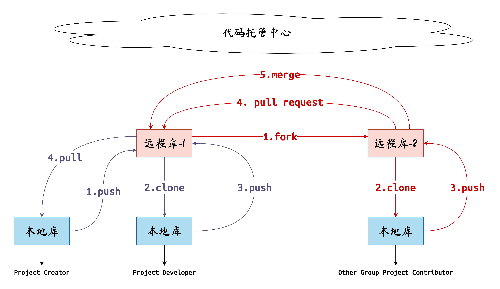

# Git Skills

[TOC]

## 1. Git概念

**Git** 是一个开源的分布式版本控制系统，用于敏捷高效地处理任何或小或大的项目。**Git** 是 **Linus Torvalds** 为了帮助管理 **Linux** 内核开发而开发的一个开放源码的版本控制软件。

- **Git**的安装：

```shell
$ sudo apt-get install git
```


- 查看**Git**版本：

```shell
$ git --version
```


- 配置**Git**的用户信息：

```shell
$ git config --global user.name "your-name"
$ git config --global user.email your-e-mail@mail
```

**注意：**用了 **--global** 选项，那么更改的配置文件就是位于用户主目录下的那个，以后用户所有的项目都会默认使用这里配置的用户信息。如果要在某个**特定的项目**中使用其他名字或者电邮，只要去掉 **--global** 选项重新配置即可，新的设定保存在当前项目的 **.git/config** 文件里。


- 检查已有的配置信息

```shell
$ git config --list
```

## 2. Git基本操作

- 创建一个**Git**仓库：

```shell
git init [folder]
```

可以指定文件夹，若不指定，则会在当前路径下初始化**Git**。


- 查看**Git**状态

```shell
$ git status
```

**注意：**该命令需要在初始化Git仓库后才能使用。该命令会打印相关的日志和提示信息，对于用户而言非常有用。


- 使用**Git**对文件进行跟踪

```shell
$ git add file.ext
```


- 取消**Git**对文件的跟踪

```shell
$ git rm --cached file.ext
```


- 提交代码到本地仓库

```shell
$ git commit -m "your commit message" file.ext
```

**注意：**如果不使用**-m**选项，则**Git**会弹出默认编辑器，让你填写提交的信息，所以为了方便，一般直接在命令行中给定。另外，提交信息一定要描述清晰。


- **Git**查看提交历史

以详细的方式查看历史提交记录：

```shell
$ git log

# output
commit 87cb394253de6ae1fe2389abd343ae98f8d84935 (HEAD -> master, origin/master)
Author: csl <3079625093@qq.com>
Date:   Thu Sep 8 20:24:22 2022 +0800

    add ins strap-down algorithm

commit 4faf143139742b019956643e7fcbecb47978b1a2
Author: csl <3079625093@qq.com>
Date:   Tue Sep 6 22:18:16 2022 +0800

    first commit
    
# ...
```

该命令的结果会得到一些列的版本提交信息（如果有的话）。对于每一次提交，具体的信息有：

1. 提交版本的哈希序列号，如：**"87cb394253de6ae1fe2389abd343ae98f8d84935"**；
2. 该次提交的用户信息，如：**"Author: csl <3079625093@qq.com>"**；
3. 该次提交的时间，如：**"Date:   Thu Sep 8 20:24:22 2022 +0800"**；
4. 该次提交的描述信息，如：**"add ins strap-down algorithm"**

另外还有一个指针，指向当前版本，如：**"HEAD -> master, origin/master"**，表示，我们当前的版本是在master分支上，对应的远程仓库版本是在**master**的**origin**分支上。


以简略的方式查看历史提交记录：

```shell
$ git reflog

# output
87cb394 (HEAD -> master, origin/master) HEAD@{0}: commit: add ins strap-down algorithm
4faf143 HEAD@{1}: commit: first commit
19eb930 HEAD@{2}: commit: add new trick
# ...
```

次命令只会打印提交的序列号和提交信息。


- **Git**版本切换

```shell
$ git reset --hard 4faf143
```

后面跟的是版本哈希序列号的头七位，可以使用命令**git reflog**查询。


## 3. Git分支

在版本控制过程中，同时推进多个任务，为每个任务，我们就可以创建每个任务的单独分支。使用分支意味着程序员可以把自己的工作从开发主线上分离开来，开发自己分支的时候，不会影响主线分支的运行。分支可以简单理解为副本，一个分支就是一个单独的副本。

- 查看分支

```shell
$ git branch -v
```


- **在当前分支的基础上**创建分支

```shell
$ git branch my-branch-name
```


- 切换分支

```shell
$ git checkout the-branch-name
```


- 将某个分支**合并到当前分支**

```shell
$ git merge another-branch-name
```


- 分支合并冲突

当合并分支的时候，如果发生冲突，需要做进一步处理。分支合并冲突发生的一般情况：两个分支在**同一个文件**的**同一个位置**有**两套完全不同**的修改， **Git**无法替我们决定使用哪一个，必须人为决定新代码内容。

具体来说，需要人为的打开冲突文件，**Git**会在文件里面标明哪里发生冲突。修改文件后**git add**，然后再提交。

## 4. Git协作

Git协助示意图：



- 团队内协作

如紫色箭头步骤所示。**Project Creator**首先用**git**初始化自己的本地库，写了一套版本，利用**push**命令将自己的本地库推送到代码托管中心(如：**Github**、**Gitee**)，团队中的其他开发者**Project Developer**通过**clone**克隆命令完整的复制到自己的本地库，进行修改之后将自己的本地库再次**push**到代码托管中心（需要**Project Creator**将**Project Developer**加到自己的团队里面），这样**Project Creator**就可以通过**pull**命令拉取其他团队内开发者修改的代码，来更新自己的本地库。

- 跨团队协作

如红色箭头步骤所示。开发团队请另一个开发团队改代码，**Other Group Project Contributor**通过**fork**命令从**Project Creator**的的远程库中拿取代码，再通过**clone**克隆命令到自己的本地库，修改完成后使用**push**推送到在自己的远程库，使用**Pull request**拉取请求给**Project Creator**，**Project Creator**审核完成后使用**merge**命令合并对方的代码到自己的远程库中，再通过**pull**命令同步到自己的本地库中，这样修改过后的代码**Project Creator**和**Project Developer**就都可以使用了。

- 具体的步骤：

1. 在远程代码托管中心创建远程库：**new repository**，名字最好和本地库名字一样，同时设置是**public**还是**private**；

   

2. 将仓库的远程链接加入到本地库别名里：

   - 查看当前本地库中的别名：

     ```shell
     $ git remote -v
     ```

     

   - 将链接起别名：

     ```shell
     $ git remote add the-alias-name the-link
     ```

     别名最好和本地库名字一样。

     

   - 再次查看当前本地库中的别名：

     ```shell
     $ git remote -v
     # output
     origin	https://github.com/Unsigned-Long/slam-tricks.git (fetch)
     origin	https://github.com/Unsigned-Long/slam-tricks.git (push)
     ```

     其中**fetch**表示拉取，**push**表示推送。

   

3. 推送本地库到远程库：

   ```shell
   $ git push the-alias-name the-local-branch-name:the-remote-branch-name
   ```

   

4. 团队内的其他开发者克隆远程库到本地（先拿到远程库链接），会自动创建别名：

   ```shell
   $ git clone the-link [target-dir]
   ```

   

5. 团队内的其他开发者修改代码后，推送到远程库：

   - 设置权限：在代码托管中心，项目创建者将团队内的其他开发者纳入进来。具体来说，项目创建者在具体项目的远程库设置里的访问权限里面将团队内的其他开发者邀请进来，其他被邀请的开发者同意邀请即可。

   

   - 团队内的其他开发者推送到远程库

   ```shell
   $ git push the-alias-name the-branch-name
   ```

   

6. 项目创建者或团队内的其他开发者拉取远程库到本地库（主要是为了同步）：

   ```shell
   $ git pull the-alias-name the-remote-branch-name:the-local-branch-name
   ```

   注意：**git push**和**git pull**的分支参数顺序

   

7. TODO:跨团队协作流程

## 5. Git子模块

当需要在朱项目中使用别的子模块，可以使用**submodule**:

1. 为项目添加一个子模块：

   ```sh
   $ git submodule add the-submodule-link submodule-target-path
   ```

   这个时候：

   ```sh
   $ git status
   On branch master
   
   No commits yet
   
   Changes to be committed:
     (use "git rm --cached <file>..." to unstage)
   	new file:   .gitmodules
   	new file:   thirdparty/logger
   ```

   产生了两个新文件，记录了子模块的添加信息，比如**.gitmodules**文件内容为：

   ```sh
   [submodule "thirdparty/logger"]
   	path = thirdparty/logger
   	url = https://github.com/Unsigned-Long/logger.git
   ```

   

2. 当正在使用的子模块版本落后与远程仓库时，可以使用远程更新：

   ```sh
   $ git submodule update --remote
   ```

   

3. 当不想使用该子模块时，可以对其进行删除：

   ```sh
   $ git submodule deinit --force submodule-target-path
   $ git rm -r submodule-target-path
   ```

   恢复删除后的子模块：

   ```sh
   $ git submodule add --force  https://github.com/Unsigned-Long/logger.git ./thirdparty/logger
   ```

   需要加一个**--force** 选项。

   

4. 当克隆的项目带有子模块时，可以使用递归克隆：

   ```sh
   $ git clone --recurse-submodules the-cloned-project
   ```

   不带**--recurse-submodules**时，不会克隆项目的子模块。这时可以使用命令进行子模块的获取：

   ```sh
   $ git submodule update --init --recursive
   ```

   其中**--recursive**是为了在获取子模块的时候，同时递归获取子模块的子模块。